# Electricity Distribution, Generation and Renewable Energy Guide
## v 1.02

## Introduction

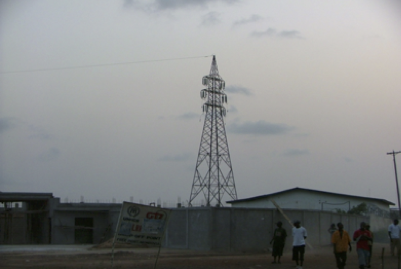

Whether it’s an office, clinic, school or the residence, electricity is an essential utility. Unlike developed countries, access to clean, reliable and safe power in the global south can be difficult and in many cases expensive. 

Access to a reliable power supplies is essential to humanitarian programming. Power is needed for lighting, cold chain, heating, communications and to run IT systems. The provisioning of safe power is also very challenging as materials in some places will be of poor quality. Lack of skills can lead to poorly installed systems which pose a serious risk to equipment and people. 

This guide has been written to improve the knowledge people managing humanitarian programmes about electricity supplies. Whilst it contains a lot of best practice advice and tips, this guide is not intended to be a detailed electrical installation guide. Electrical installations should always be carried out by qualified electricians who have demonstrable skills. 

Whilst it’s very unlikely that the high standards required under law (IEE for the UK) will be reached, aid organisations have a responsibility to all of its team to provide a safe working environment. This guide illustrates electrical best practices.

This guide also includes some planning tools to help you estimate energy needs for any site. Good planning will enable you to select the correct size generator or solar system for the site. 

The first edition of this guide was created by Mark Hawkins for Merlin in 2012. It has now been shared freely with the Nethope community to help all members to create a safe working environment for Aid Workers and beneficiaries. I hope that in the near version, that this guide will be replaced with a more up to date version incorporating more information about renewable energy. 

Mark Hawkins 
Global Humanitarian Technology Manager 
Save the Children International 
December 2018

## Contents
1. [Introduction](#Introduction)
2. [Safety](Safety)
    - [Electricity Kills!](#electricity-kills)
    - [Fire Risk!](#fire-risk)
    - [Working practices](#working-practices)
3. [Power Supplies](#power-supplies)
    - [Sources](#sources)
    - [Single Phase](#single-phase)
    - [Three Phase](#three-phase)
    - [American Standards](#american-standards)
4. Power Distribution
    - Circuit Design
    - Grounding
    - Quality of parts
5. Site Planning
    - Utility Power
    - Stored Energy
    - Selecting the correct generator
    - The energy planning toolkit
        - Generator Sizing Tool
    - Cable sizing tool
6. Generator Management
    - Daily routines
    - Weekly Routines
    - Monitoring
    - Servicing
    - Spares & Consumables
    - Change Management
7. Solar Energy
    - Planning
    - Typical system design
    - Lightning Protection
    - The Load
    - Rugged design
    - Change Management
    - Maintenance and sustainability

## Safety
This chapter highlights some of the risk experienced in NGO sites every day. Whilst there are a few extreme examples of bad practice or poor design mentioned, the majority of the problems illustrated have been collected from a wide range of sites over the past fifteen years.
### Electricity Kills!
In the aid sector, the provision of a safe and efficient electrical system is not treated as a priority. As a result, severe risk of electrocution will exist in the office, the bathroom and the bedroom. There have been reports from the field where team members have received electric shocks whilst operating equipment. In one severe case, an aid work was killed in one agency when a team member was electrocuted in a bathroom

Here are some examples of defects which are presenting danger to people;

 | Example | Description |
 | --- | --- | 
 | 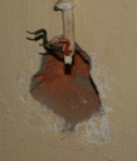 | A wall socket was missing in a bedroom leaving two bare wires exposed. A visitor to the room not aware of this cable could have easily touched it and may have received an electric shock. |
 | 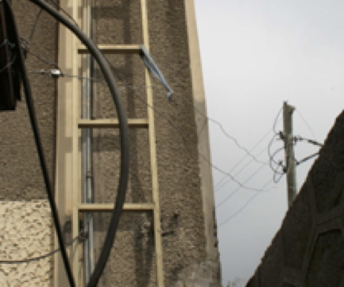 | 
A power line from the national grid comes over the wall. The power cables are not insulated. Under normal circumstances this would not be an issue as grid cables arrive at roof level well out of the reach of people.

In this example, the cables pass within centimetres of a roof ladder. There are two significant risks here
<ul><li>People ascending the wall ladder to deal with communications equipment is very likely to come into contact with the live cable.</li><li>If the ladder comes into contact with the cable, it becomes electrified. The bottom of this fixed ladder is close to a busy passageway.</li></ul> |

### Fire Risk!
Poor quality electrical installations can cause fires through short circuits. There is one extreme example where an electrical fault in an ammunition store resulted in major explosions in Brazzaville (Republic of Congo) in March 2012. More recently in 2017, an NGO suffered a series fires it its country head office (south Sudan) because the cabling used was too thin.

Fires can happen as a result of overloading of circuits, poor storage of flammable liquids, paints, gases as solids adjacent to switches and generators. The breakdown of cable insulation can lead to fire. Rodents in roof spaces are well-known for eating insulation. Once the plastic insulation has gone, roof fires can easily occur.

### Working Practices
Unskilled staff working with poor quality tools will also be at risk. In developing countries, electrician’s tools are normally of a poor quality and poorly insulated. 

### Conclusion
Now that you have read all the horror stories about what could happen if we neglect the concept of safe electrical practice, please read on!  The rest of this guide explains how safe and reliable electricity can be achieved. 

## Power Supplies
A stable power supply is essential for the smooth running of appliances in offices and residences. Where supplies are unstable, measures will be needed to protect equipment and in some cases to ensure continuity of supply during power cuts.

Supply voltages will be different depending upon the country and circuit type used. In most places, voltages will be 220V, but in the USA, South America and the Caribbean, it will be 110V. Some circuits will contain a mixture of voltages, which means a lot of care needs to be taken by electricians when setting up power systems.

### Sources
In general, power will come from one of three sources, the local grid, and a generator or from battery (charged via a battery charger or a solar system). For smaller sites which rely on battery storage, it’s often better to set up as many systems as possible to run on 12v. Where needed, inverters can be used to convert 12V DC to either 220V or 110V AC.

Quite often, a combination of sources will be required for example a backup generator may be needed for places where grid power is unreliable. Where there is no grid supply at all, two generators will probably be needed.

### Single Phase
Most people direct experience of electricity will be in either the home or office where single phase power is normally used. In Europe, Africa Asia and the Middle East, the voltages will be 220V AC, but in the USA, South America and the Caribbean, its 110V AC.

Single phase supplies are simple and consist of two lines to supply power (Neutral and Live). A third Earth cable is also included for safety.

Smaller generators (typically less than 9 KVA) will produce single phase power.

### Three Phase
Almost all utility companies will generate electricity using three phase power. Whilst single phase is normally supplied to smaller domestic buildings, larger buildings may be supplied by three phase power.  The output from larger generators will also be three phase.

Three phase power consists of three lines each providing 220V AC. A clear understanding of how these lines relate to each other is essential as if mistakes are made in setting up circuits, it’s possible to supply 380V AC to a circuit and cause a lot of damage. 

If three phase power is supplied from a generator, the site circuit must be designed in such a way so that the total load from all electrical items on the site is equally distributed across all three phases. 

Over the years, there have been plenty of examples where a single output on a three phase generator has been used. This will significantly shorten the life of the generator as the wear on the internal parts will not be even. The alternator is the part of the generator which creates the electricity. As internal parts rotate, if only one phase is used, resistance will only be encountered for just 1/3rd of each rotation. This is uneven resistance is what causes the excessive wear on bearings and windings. 

The following diagram shows a typical output from a three phase supply which consists of four cables. A neutral line is common to the other three lines. So a link between neutral and any of the three “Live” lines will deliver a 220V AC Supply. 

**BEWARE!!!**
**Never connect equipment between the “Live” lines (1+2, 1+3, or 2+3) as the respective voltage will be 380V AC. The correct way to provide supplies will always be a combination of one “Live” line and “Neutral”**

Alternating Current (AC) from either a generator or a utility supply will alternate between +220V and -220C up to 60 times per second. The transition from positive to negative follows a “Sine Wave” pattern.

In a three phase circuit, the outputs from the three lines are not synchronised. They are in fact separated by about 1 third of a cycle (which is the same as one third of a rotation on the generator).

The diagram below demonstrates clearly the relationship between the lines. 

If measurements are taken between any of the lines and neutral, the maximum voltage reached is 220V AC. This is shown by the red dotted line. 

The blue dotted line shows a measurement between the red line and the blue line where the blue voltage is at +220V and the red voltage is at -160V. This means that the total difference in voltage between the two lines is 380V AC.

### American Standards
Power generation in the USA starts out in the same way as it does for the rest of the world as three phase power. In a typical domestic residence, two lines of 110V AC is supplied. The twin outputs is derived from a 220V AC single phase line via a centre tapped transformer which would be located in a neighbourhood substation. The diagram below shows how a centre tapped transformer modifies the output. 

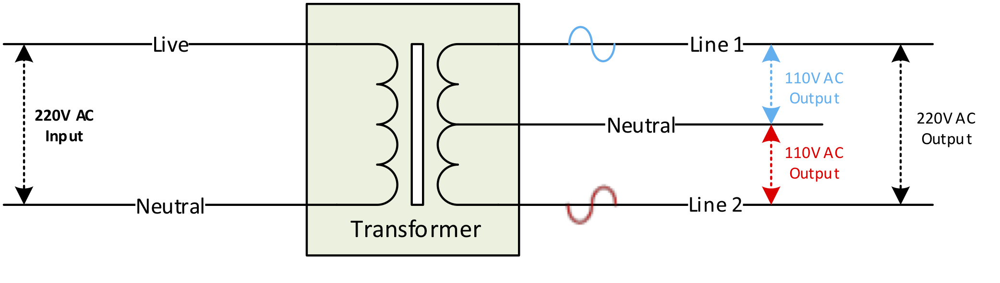

The single phase input of 220V AC is feed to the primary coil in the transformer. The secondary coil has an identical number of winnings but a third cable is joined to the central winding. This results in twin outputs of AC which are exactly in opposite phases. So any device connected between the neutral and   either line will be supplied with 110V AC. By connecting directly between Lines 1 & 2, 220V AC is available. 

The following graph shows the relationship between both lines and how two lines of 110V can be used to provide 220V AC

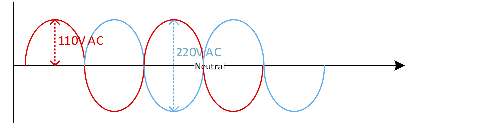

It is common practice to supply both lines to domestic sites in the USA. In general, lines will be split up between floors where 110V is supplied to sockets and lights. Heavy duty appliances such as water heaters and air conditioning are normally hard wired into the circuit and supplied 220V AC by using both lines. 

For emergency teams deploying to places where USA circuits is used, it is often believed that step up transformers are needed to convert 110v to 220V. This is clearly not the case. As long as both lines can be clearly identified, a separate circuit can be used to supply 220V. Be sure to use a different type of plug and socket so that 110V equipment cannot be accidentally connected to the 220V supply. 

## Power Distribution
So far, we have focused on providing electricity which is stable from a number of sources. The business of getting electricity from its source to where it’s needed is also important. If electrical circuits in a site is poorly designed or incorrectly installed, circuits could become overloaded thus presenting a fire risk, energy loss or in severe cases a risk of electrocution may exist. 

### Circuit Design
The diagram below shows an example of a typical site which has access to two supplies (electricity from a local utility company and a back-up generator)

Three phase power is used in the example which is fairly typical for medium to large offices. In smaller buildings (Typically residential settings), single phase is used. The following notes explains further about each key feature of the circuit. 

* **Local Utility Supply**: The cable which supplies power to the site is normally the responsibility of the utility company. They will own all cabling including the electricity meter up to the first junction box. Local standards vary, but in general, the first junction box will belong to the utility company and all circuits downstream is the responsibility of the customer. The above diagram is simplified and shows the utility power connected direct to the changeover switch.

* **Generator**: The generator in this example provides back up power to the site. It has been sized up to match the demands from the loads throughout the site. Like the utility supply, electricity is three phase. 

* **Change over switch**: The purpose of this switch is to make sure that both supplies (Generator and utility power) are not supplied to the load simultaneously. This switch normally has three positions which are supply 1, supply 2 and isolate. It is important that the switch is rated to match the total load of the circuits. For example, if the total load is 18KW, then maximum circuit current will be: 
    * 18KW = 6KW per phase (6000 Watts) 
    * 6000W ÷220V = 28Amps per phase
Remember, it’s the load that you need to match and not the size of the generator. It’s possible that greater loads may be drawn from utility power than the generator. In more advanced countries, the utility supply will be delivered via a master fuse box. The changeover switch rating should be equal to or greater than that of the utility fuse. 

NOTE: It has been known for unqualified electricians to place a changeover switch into the circuit between the utility supply and the electricity meter. This means that at times when utility is not available, power would be supplied from the generator to the circuit via the meter, thus meaning that the site would be charged by the utility company for power from the generator. 

* **Distribution / Fuse panels**: The key purpose of a fuse panel and its fuses or circuit breakers is safety. Circuit breakers or fuses are sized up to prevent cables and equipment from becoming overloaded. 

    * **Main distribution panel (3-phase)**: The main distribution panel splits the phases into three separate circuits and where needed, a three phase circuit is provided as well. In this example, the generator can produce a maximum of 25A per phase. To avoid overloading, circuit breakers are arranged to provide three single phase outputs rated at 20A and one three phase output of 15A (5A per phase). 

    * **Secondary Fuse Panels**: further panels are placed further down line. These can divide up loads into further circuits. The example shown on Phase 3 shows that the circuit has been divided up into four sub circuits. The total load must not exceed 20A. Circuit breakers could be set to divide the load as follows:

        * Security lights: Total = 400W (2A); 3A assigned for future expansion. 
        * Heater = 2KW (9A); 10A assigned
        * Lights = 200W Total (1A): 2A assigned
        * Power sockets: 5A. This is the remainder of the 20A left over. 1.1KW maximum loading permitted. 

* **Cables**: The cables used to link power sources and switch panels must be sufficiently large enough to carry the load. Larger cables will be needed closer to the supply. For a 25A load, 6mm cable will be needed, but further down the line where the maximum load is 5A, 1mm cable will be sufficient. The cable sizing tool should be used for the best results. 

For longer cable runs, thicker cables should be considered as they will reduce power losses. 

### Grounding
In developed countries, laws governing grounding of electrical equipment is very strict and have been in place for many decades. It’s a well-established fact that faulty electrical equipment which is not grounded is likely to be lethal.

Grounding is essential as if there is an electrical fault in an appliance, electricity goes to earth thus preventing anyone using the faulty electrical item from being electrocuted.

In many developing countries, electrical circuits may be in poor condition and may not have grounding in place. It’s essential for safety of all staff to ensure that circuits are checked out and grounding put in place.

In a well-designed circuit, grounding rods should be close to where power is being supplied. In a domestic or small office setting, one central grounding rod is provided per building and will cover all of the distribution panels inside the building. In larger offices, more than one grounding rod will be needed.

From the distribution panels in single phase circuits (220V & 110V) three cables will supply all sockets and lights. The Live and Neutral will be used to power all appliances. A third cable will be used to link wall sockets and light fittings to the ground system.

Three pin sockets must be used throughout the site so that equipment which is supplied with the appropriate cords will also be grounded.

Extension cables are often a weak link in a circuit as if they are used often, they can become worn. Good quality extension cables must always be used and must away include a grounding core cable.

In addition to providing local grounding rods for each building, each generator must also be grounded with its own independent rod.

### Quality of parts
It is paramount that good quality components are procured for electrical circuits. In developing countries, many items on the local market will be of Chinese origin and made from very poor quality weak plastic. Covers to sockets and switches will break leaving exposed circuits which will present an electrocution hazard to people.

Extension leads with multiple sockets are used in great quantities throughout most sites. Not only do they transfer power from a socket to a number of appliances. Poor quality extension leads must be avoided as they will present a number of hazards as follows:

* Damage to covers will expose live parts.
* Thin cables can be overloaded and present a fire risk.
* Sockets may be a little bigger than the sockets which will lead to arcing. If a computer plug is placed in a lose socket, unsaved work may be lost when the plug falls out of the socket.

 
## Site Planning
The previous sections of this guide has focused on sources of power supplies, the differences between single and three phase, USA power supplies and safe power distribution inclusive of grounding.

This section deals with the practicalities of designing a power supply system for a field site. The best way to approach the task of providing power is to establish the quality and reliability of the local utility power and then define what back up capacity may be needed.

A number of tools are available in the energy planning toolkit to make the task of planning easier.

### Utility Power
The quality and reliability of a power supply from the local utility company should be taken into account before signing the lease on any building. In many developing and middle income countries, power cuts will be frequent. Power supplies can be more reliable is some parts of town than others. 
The overall aim is to ensure that there is enough power available at all times to enable an office to operate normally, or a residence to be comfortable.

The following table sets out four power supply scenarios and potential solutions.

 | Utility power status | Solution |
 | --- | --- |
 | Stable utility power with electricity available 24 x 7. Power cuts very infrequent with no seasonal variations. When there are power cuts, they last no longer than a few minutes. | Minimum investment on alternative power. Desktop computers and network gear to be provided with UPS. |
 | Power supply reliable and stable, but subject to a small number of power cuts each week ranging from 10 to 120 minutes. No seasonal variations | UPS for network items and desktop computers. Battery bank and inverter to supply power to the site in the absence of utility power. |
 | <ol><li>Power cuts frequent but not exceeding 50% of the working day.</li><li>Reliable power for part of the year, but during a 4 month season, power supplies are unreliable.</li> | UPS for network items and desktop computers.  Standby generator to run the officer for periods when the utility supply is offline. |
 | Utility power is non-existent or very unreliable. | UPS for network items and desktop computers.  Two generators with the ability to use utility power when it’s available (assuming that it can be trusted!) |

 It is fairly obvious from the table that the more unreliable the local utility supply is, the more money which needs to be invested to ensure that the site is adequately provisioned. The following pages will cover the specification of back up supplies in more detail. 

### Stored Energy
For offices where power cuts are infrequent and short, standby power can be provided by using a stored energy system. The design is fairly simple and consists an inverter and a battery bank. 

When normal power is supplied, the inverter will keep the battery bank topped up. During power cuts, the inverter will convert the battery energy in to 220V AC to keep the office running. 

The approach to designing a stored energy system is similar to methods used to design a solar system. The key factors to consider are:

* The inverter must have enough capacity (in amps) to run the loads in the office
* The battery bank must have enough capacity (in amp hours) to run the inverter for the required period of time. 
* Circuits should be laid out so that non-essential items such as air-conditioning and water heaters are not connected to a circuit supplied by the invertor. 

Here is an example:

 > **Requirement**: An office requires a back-up power system which has enough capacity to run an essential load of 2.5 KW for three hours. 

 > **Solution**: 2.5KW = 2500 W, 2500 W ÷ 220V AC = 11.36A (Round up to 12A). The inverter must be capable of delivering a load of 12A. Most inverters are specified in KW. 

 > 2500W ÷ 12V= 208A. This means that cables connecting the inverter to the battery bank will need to be large enough to support such a large current. 

 > Given that the DC current is 208 A, to run the office for three hours, the calculation to use is 208 A x 3 Hours = battery capacity of 624AH. 

Stored energy solutions can also be used in combination with generators in places where power cuts are more frequent. The benefit to this approach is that overall fuel consumption can be reduced and generator usage at night can be avoided.

### Selecting the correct generator
Choosing the correct generator is not as simple as looking at the budget available and buying the biggest and hoping for the best. The generator needs to be matched closely to the load which it is expected to supply power to. A generator sizing tool is included in the energy planning toolkit to assist teams choose the right size generator. 

If a generator is too small, it will become overloaded frequently and the office will not run efficiently. Where capacity is greater than needed, an underutilised generator will be expensive to run and in the longer term, there could be problems with the engine.

One of the most frequent mistakes made is where three phase generators are specified but only one phase is out to use. This is extremely bad practice and can significantly shorten the life of the alternator part of the generator. 

Where possible, only single phase generators should be procured as most buildings are wired up as single phase. In many local markets, choices are limited. It’s not unusual to be faced with a situation where all generators over 5KVA are three phase. Where this is the case, the best solution is to rewire the office so that loads are divided between the three phases. 

As a rule of thumb, it is best to target selecting a generator which has around 20% more capacity than the maximum load (Maximum load does not necessarily mean total load as all electrical items on side may not be used simultaneously). The generator sizing tool has been designed to work out average loads for day and night. In places where two generators are needed, a significant difference between day and night loads could lead to generators of different sizes being selected. 

Other important things to consider:

* **Fuel**: Most generators will run on diesel, but some smaller generators will run on petrol. Where possible, favour diesel over petrol as diesel is safer to store and is often cheaper. Diesel engines are more basic than petrol engines and therefore less likely to fail. 

* **Make/quality**: Generators are bulky and heavy, therefore is very likely that generators will be purchased in the same country. Well-known brands such as FG Wilson, SDMO and Perkins. More obscure makes especially from China should be avoided as they are often built to a poor standard. 

 > Some generator sets are often assembled in country by local companies using internationally branded components. For example, if a locally built generator consists of a Caterpillar engine and a GEC alternator, then is quite likely to be a good generator and suitable for use by NGOs.  This practice is fairly common in Europe as well, for example, FG Wilson uses Perkins engines.

* **Supplies**: Generators will need a constant supply of consumables such as air, fuel and oil filters. Ensure that there are supplies of genuine parts available in country for the generator to be purchased. 

* **Location of generator**: The eventual place where the generator will be set up will probably involve some compromises. The location for the generator must be as close as possible to where power is being consumed. If the generator is placed too far away from an office, long cables will introduce some voltage drops, possibly enough to stop freezers from working correctly. 

 > Generators produce a certain level of noise, so should be placed as far away as possible from meeting rooms, sleeping areas etc. Further measures such as sound proofing enclosures and walls made from sand bags will also help to reduce noise. 

 > Exhaust from a generator will contain carbon monoxide which can kill. Where generators are situated within generator rooms, exhaust MUST be piped to the outside. The siting of generators and generator rooms should also be located in places where prevailing winds will not blow fumes into office workspaces and accommodation areas. 

* **Servicing**: When procuring a generator, establish the supplier’s competency to service the generator. For smaller programmes who do not employ mechanics, outsourcing servicing should be considered. See the managing generator section for more detail.

* **Security/fuel store**: Fuel, parts and even the generator itself should be considered at high risk of theft, especially if the generator is located outside of the main confines of the compound. The generator should be located in a secure place. Spares for the generator should be kept under the control of a warehouse and never in the same room as the generator. 

 > Fuel must be stored in a well-ventilated place and never inside a generator room. There should be no fire risks or electrical items in the fuel store. 

 > Large fire extinguishers must be kept close to the generator and the fuel store. 

 > An emergency remote fuel cut-off handle should also be considered so that fuel can be isolated to the generator from outside of the generator room. Mechanical remote options are easy to source. 

* If local utility power is so unreliable that a generator needs to run for more than 12 hours a day, two generators must be provided. 

### The energy planning toolkit
In some cases, the main energy source for a site will be from a generator, solar system or from a national power company. Where national power is unreliable, a backup generator may be needed.

The energy toolkit consists of two excel spread sheets. One to estimate the correct size of generator needed, and the other to estimate the hardware needed for a solar power system.

When using the planning tools, the first task is to list all of the equipment on site and note how often the equipment is used. Additional information will be needed such as altitude and availability of sunshine during the day. Each tool will present an analysis of power requirements which should be sufficient to specify the best power solution for the site. 

### Generator Sizing Tool
The screen shot below is of the input page. This is where all electrical items will need to be listed.

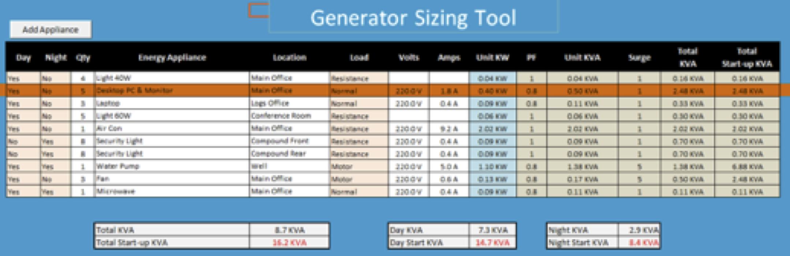

The following colour convention is used in the tool:

 | Colour | Meaning |
 | --- | --- |
 | Light Orange | In these columns select correct option from drop down menu. |
 | White | Data entry area |
 | Light Blue | This column can be edited if no information has been calculated |
 | Light Green | Results – please do not edit! |

The following notes explain the information needed in each column for electrical appliances. 

* The first two columns are used to define when the appliance is in use. Select Yes or No if the appliance is in use day, night or both. 
* Enter the number of appliances in the next column. For example, there are four 40W lights listed for the main office. 
* Include the location of each item. 
* In the load column, you will need to specify what type of appliance is in use. This is used later on to calculate the conversion from KW to KVA and the start-up KVA. 

Generally, all heaters (not fan heaters), Lights, kettles, water heaters are classed as “Resistance”. Refrigerators, Water Pumps, Air Compressors, Air conditioning, power tools and fans are classed as a “Motor”. Select “Normal” for all other items. 

* Enter the correct values in the Volts and Amps column for each appliance. This information will be used to calculate “Unit KW” for the next column. (Formula is 
Watts = Volts x Amps).

The last five columns will display the results based on the information provided on the first 9 columns; 
* PF: This is the power factor used to convert from KW to KVA. This will be applied to all items except “Resistance” loads. PF can vary between different types of equipment. The value of 0.8 is an industry recognised average. 

* Unit KVA: This is the KVA calculated for each appliance.

* Surge: Any equipment containing motors will consume 5 times the amount of energy normally used for a few seconds during start-up. The value of the surge is based on the type of load selected in column 6. 

* Total KVA: This is the total KVA for multiple units (e.g. if four lights are listed in the QTY column, then Unit KVA will be multiplied four times to reach the total.

* Total Start-up KVA: This result is calculated by multiplying surge by total KVA. 

The three boxes below the main table will display the totals from the main table. The first box will display total operational and start up loads for all equipment (i.e. if earthing was switched on at the same time). The following two boxes will display loads for day and night. This information is calculated by the selections made in the first two columns for each appliance. 

More lines can be added to the sheet by selecting the “Add Appliance” button. Please note that the new line will be a copy of line two and inserted a new line two (all exiting entries are moved down by one line).

The analysis page is linked to the input page. The same colour convention is used on this sheet. 

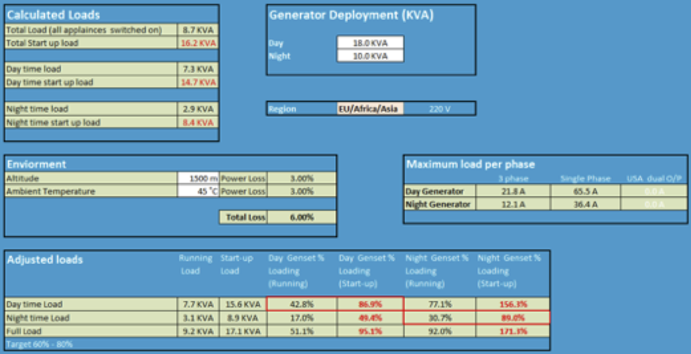

The page is arranged into a series of boxes which display the information you will need to estimate the generator size. 

**Calculated Loads**: This load information is fed from the input page.

**Environment**: Enter the altitude and ambient temperature for the generator site. An altitude of 1000 m and 40˚C are default values. Above these values, the environment will cause power loss on the engine. Industry standard corrections will be applied for values above 1000 m and 40˚C. 

In the screenshot, a correction of 6% is applied. 

**Region**: Select the region, this will select the correct voltage for the generator (110V is applied for North and South America and 220V for the rest of the world). 

**Generator Deployment**: As loads can differ between day and night, it is often possible to use a smaller generator at night (and save costs). This form has been designed so that two generators can be entered and the capacity of each generator compared with the load. If on one generator is to be deployed, then enter the same value in both boxes (Day and Night). 

**Maximum Load per phase**: This box will display the maximum load in AMPs which can be put on each phase. The information is calculated by converting the values listed in the “Generator Deployment” (converted to KW using PF 0.8) and the regional voltage. (Formula: A = W/V)

If the “Americas” region is selected, Single phase and two phase loads will be displayed. For the rest of the world, single and three phases will be displayed. 

(Use the appropriate value which applies. Generators are either single or multi-phase).

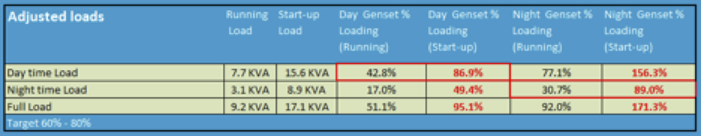

The “Adjusted Loads” box (see above) displays full, day and night loads (running and start up). These loads have been adjusted for altitude and ambient temperature. The final four boxes compare these loads with the size of generator specified in the generator deployment box. 

The day time loads are compared to the day generator and you will see the utilisation displayed as % and highlighted by the red border. Loadings are displayed for the night generator as well (you can see that if the night generator were to be used, it would be overloaded.

The same layout is used for the night load (note that the appropriate output is highlighted by a red box).

The final line shows how both generators will be utilised under full load. 

### Cable sizing tool

The correct selection of cables to transfer power from its source to the load is very important. The selection of inadequate choice of cables will lead to the following issues:

* Loss of voltage – resulting in performance issues with equipment. 
* Overloading of cables leading to the risk of fire. 

The purpose of the cable sizing tool is to provide logisticians and electricians with a means to calculate the correct cable sizes for the electrical system. 

To use the cable sizing tool, you should firstly modify the information at the foot of the sheet for your location as follows: 

**Voltage**: The default voltage is set at 220V in the template. The voltage is used to calculate the acceptable voltage range (which is +/- 5%). 

or most places, you will use 220V. For the Caribbean and North and South America, the voltage is 110V. 

Note: For the same load, the cable sizes on an 110V circuit will be double the size of cables used on an equivalent 220V circuit because current (A) will be double. 

**Temperature**: Enter the average ambient temperature for your location. For each degree over 15˚C, there is a 0.6% voltage loss in cables. 

**Cable Resistance (Ω)**: The default setting for cable resistance in the template is 0.175Ω which is the correct value for copper cable. In the unlikely event that other materials are used, please contact the technology team in London for advice. 

The screenshot below shows the cable sizing tool which consist of just one sheet in excel. The same colour convention has been used as for the other tools with the exception of columns 6 and 12 which will change between green and red depending on a comparison between the cell value and set criteria. 

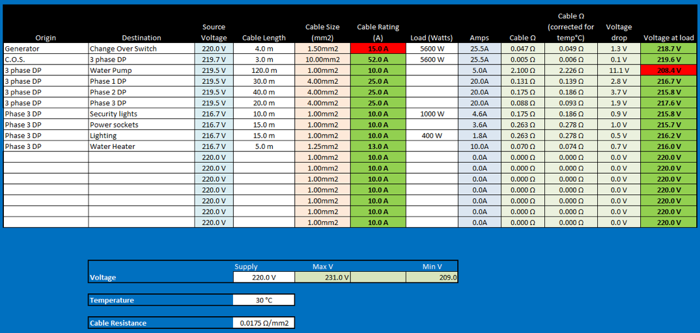

As there is plenty of safety margin built into calculations, Watts is the measurement used throughout. No attempt is made to convert between KW and KVA.

**Columns explained**: 
* The first two columns define the cable route (origin and destination). 
* The source voltage is by default taken from the voltage set at the bottom of the table. For some lines, this value may need to be changed. 
* Cable lengths should always be entered no matter how short the run. The unit of measure must be metres. 
* Cable sizes are based on European standards. See conversion chart below for nearest AWG equivalent. Cable sizes can be modified by selecting from a drop down list. 
* Cable rating is in Amps and will change depending on the size of cable selecting in the previous column.
* Enter the load at the end of the line in WATTS. 
* Amps are calculated based on the voltage and load values. Amps are the most important value as it’s used to select the correct type of cable to carry the electricity. 
* Cable resistance is a calculated value based on the material resistance (in this case based on copper), the cross section size (mm2) and length (m) of the cable. 
* The next column is the cable resistance corrected for ambient temperature.
* Voltage drop is calculated by dividing Amps by resistance (Ω). 
* The final column contains the calculated voltage at the end of the cable (Load). 
 
Selecting the correct size cable: There are two factors to keep in mind when using the tool to select the most appropriate cable:
* Firstly, the amount of current going through the cable (Amps) must not exceed the current the cable is designed to carry.   
* Secondly, the voltage at the end of the cable should be within +/- 5% of the voltage present at the source. 
 > *“The thicker the cable, the more current it can carry and the less the drop will be at the load”*

#### Examples
* The cable selected in line 1 connecting the generator to the changeover switch is 1.5mm2 in size and rated to carry 15A. The actual load is 25.5A; therefore the cable will be overloaded. Note that the cell shows red to indicate that the wrong choice has been made. 

* Line 3 in the screenshot shows a 120m cable run to a water pump. 1.0mm2 is selected and is rated at 10A which is more than sufficient to carry the 5A load. The resistance in such a long cable results in an overall drop of 11.1V which places the voltage outside of the +/- 5% criteria. The cell show red to illustrate that the cable is not sufficient. By selecting the next size up bring the voltage into scope and the cell changes to green. 

 
## Generator Management
Generators will last for a long time if they are well looked after. Through a combination of daily/weekly monthly routines, procedures and servicing, generators can be kept in good condition. The following notes cover what routines need to be put in place.

The advice in this section is fairly generic and covers best practice. A more detailed and specific set of procedures and routines can be established after consulting the service manual for the generator as the manual will define how often certain services need to be carried out. 

### Daily routines
The following procedures can be applied to most generators. These routines are important and should be followed with some rigor as good practices will ensure that the generator will run smoothly and will not cut out. 

#### Daily Checks
Every generator must be checked daily. The check must be carried out before the generator is started. The best time to do this is before the office opens. In places where two generators are in use, it is likely that there will be a day time and night time generator. The best routine to follow will be to check the day generator before it is started, and then check the night generator in the afternoon when it has had time to cool down. 

The daily check should be printed out in local language and posted near to the generator. A service log should be set up to record checks have been done. The checklist must include the following items; 
* Top up with fuel (and clean any spillage). Log how much fuel was added.
* Check the oil level – Note that there are two levels on the dip stick, Min & max. The level must be between the two. This check to be conducted on a cold engine!
* Check coolant levels (water/anti-freeze)
* Fan and drive belts must be inspected to make sure that they are tight and not worn. 
* General inspection of the generator, make sure none of the parts are loose and that no cables are wearing out due to vibration. Make sure cables which pass through metal panels are protected by rubber grommets.
* Log the engine hour reading before starting the generator. 

#### Start up
After daily checks have been completed, the generator can be started. The following procedure should be used:
* Ensure all circuit breakers are switch to off. This enables the generator to start up off-load. 
* Check that the generator is in a fit state to be started. Essentially this means that following a check, all fuel caps are secure, cleaning rags removed and all sound proof panels locked into position (if there are such panels). 
* Ensure nobody else is in the vicinity of the generator (e.g. a mechanic working on the generator but out of view from the operator).
* Start the generator according to the manual.
* Leave the generator to settle for 30 seconds
* Place switch on the load. 

#### Supply change over
The changeover switch is used to move between differing supplies whether they be generators or from the local utility company. The purpose of the changeover switch is to move between supplies and not to place both supplies online at the same time. Most C/O switches are manual which means that when moving between supplies, there will be a loss of power to the site for a short period. 

It’s therefore important that on each occasion the supply is switched, that the following routine is followed. The first item is possibly the most important task in the list!
* Before switching the supplies, the operator must inform all staff in the office that a switch over is about to be made. People using computers can then save data and shut down PCs if needed. 
* Check that the supply to be brought online is ready (e.g. generator running). 
* Move the switch slowly but firmly from the current supply to the new supply. 
* If the supply taken off line is a generator, follow the correct generator shutdown procedure. 

#### Shut down
If a generator has been running for some time, it may need to be left running off-load for some time to allow a controlled cool down. Further details regarding cooling down periods can be found in the generator service manual. 

The following procedure should be used to shut down a generator. 
* Inform staff that power is about to be lost (or switched)
* Take the generator off load using the circuit breakers.
* Let the engine run for a further period to cool down (5 minutes or as specified in the service manual)
* After the cooling down period, shut down the engine.
* Log the time of shutdown and note the engine hours. 

#### Weekly Routines
Overtime, dust and grease can build up on a generator and within the room around the generator. Most of the items listed in the weekly check list below should be carried out during the weekend when not so many people are in the office;
* Clean the generator but take care not to spill water into the alternator. 
* Clean the area around the generator so that the space where the generator is located is clear of rubbish and any oil or fuel spillage is cleared up.
* Inspect all fuse panels, cabling and change over switches in the generator room and report any damage to the Logistics team. 
* During normal office hours, log the generator loading. This is measured in AMPs. This value is normally available from the generator control panel. (See manual for more details). There will be a reading for each phase. 

#### Monitoring
The Generator logbook should be used to record engine hours, fuelling and loadings. From this information, the performance of the generator can be monitored. The data can also be copied into a spread sheet for further analysis so that the overall efficiency of the generator can be checked. For example, engine hours, fuel added and generator loading can be analysed to establish average consumption for different loads. Any wild variations could indicate a problem with the engine or perhaps theft of fuel.    

#### Servicing
Every generator needs to be serviced when a specified number of engine hours have been run. For some generators a basic service will need to be conducted after 100 hours of run time, others may be longer. It’s therefore important to consult the service manual to ensure that the correct servicing interval is used. 

For some generators, two types of service may be required. For example, a basic service would consist of a change of oil filter, oil and air filter. A more advanced service could be based on the basic service with a few additional items to be changed such as gear oil and fuel filters. 

#### Spares & Consumables
Only genuine engine spares are to be used on generators. Stock levels should be sufficient enough at each site to ensure that all engines are serviced when the servicing date is due. In places where supplies are difficult to get, a larger number of consumables should be kept at each site so that stocks will not run out of replacement lead times are long.  

#### Change Management 
No changes should be made to the electrical systems in any site without reviewing the total impact on the capacity to produce power at the site. Problems often occur when people add air conditioning units to a site without considering how this will impact the overall capacity of the generator. Significant additional of kit will eventually require a new generator to be sourced. The Logistics Team should be looking at the overall country need as if a new generator is needed, the generator to be placed could be put to good use in a new site.

Modifications should not be made to any generator. The picture below illustrates a modification which could lead to permanent damage to the generator. 

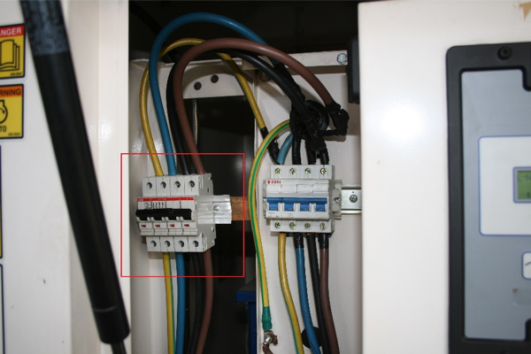 

The picture shows an additional set of breakers (red box) which have been added alongside the original breakers (blue switches). The original breakers have been designed to prevent the generator from being overloaded. By splitting the cable from above the switches and adding the new set, it is possible for the combined load for both sets of breakers to exceed the current rating of the original switches and thus burn out the coils on the alternator part of the generator. 

## Solar Energy
The purpose of a solar energy system is to provide electricity to a site without having to depend on fuel supplies or municipal power systems. Solar system like many renewable energy sources are good for the environment and is silent. The implementation of a new solar system will be more expensive than using generators, but over time the total cost of ownership will be less. 

This section covers planning, installation and maintenance of solar systems. It should be viewed as a guide for project managers and logistician and should be consulted before project planning commences. 

Where solar systems are proposed for a location, this guide should contain enough information to allow a team to appoint a local company to install a solar system. For large scale projects a different approach is required as the financial risk is greater. Where large scale solar energy projects are being considered, the time to involve solar energy experts is at the very beginning, when the project is at its conceptual stage. The Logistics Team in London have technical expertise needed and must be informed as soon as a solar project is proposed. The London team will work closely with the country team to deliver a successful project. 

### Planning
Solar panels have a finite energy output and will only produce energy during the day. Energy output will be at its maximum strength on sunny days but significantly less on cloudy days. Solar panels are expensive to buy and can be expensive to transport. Good planning is necessary to ensure the system is correctly specified to service the energy demand. Budget holders will be interested in keeping costs to a minimum, so it’s important not to provide more capacity that needed.  

Once a new system is in place, efficient change management policies will be needed. The system must be designed and installed in such a way to make it difficult for people to “Tap into” the supply and run power to additional equipment which has not been planned for. It’s better to get the design correct from the start of the project and perhaps allow enough excess capacity for known future load expansion. 
An efficient change management policy will ensure that where needed, systems will be expanded and engineering work commissioned to make changes is to a high standard.  

#### 12v DC or 220v AC?
Most solar systems operate using a range of low DC voltages. The output from the solar panels will range from 12v DC upwards. Battery voltages and the output from the regulator will in most cases be 12V DC, but systems which use higher DC voltages do exist.

A frequent approach used in solar system design is to include an inverter which converts 12v DC to 220V AC. The AC power is then used to power standard light bulbs. The use of inverters will introduce an energy loss. Further energy loss can also occur in power supplies which convert 220V AC back to 12V DC!  

Most appliances such as lights, satellite phones, radios and mobile will run on 12v). It’s even possible to run a laptop on 12V DC with a DC/DC converter.  A 12V only solar design will be more energy efficient and possibly cheaper that the systems which rely upon inverters. The concept of the 12V circuit is not new. This approach has been used in offshore boats for many decades. 

#### Lights; Watts or Lumens?
Lighting technologies have improved over the years. The lighting output from a standard 100W filament bulb is equal to the light output from a 25W energy saving bulb. The new LED bulbs have brought energy consumption down to single figures. As technology develops further, it is very likely that LED bulbs become more efficient.  Due to the rapid change in technologies, some organisations are beginning to specify lighting requirements in Lumens which is a measure of lighting intensity over a specified area. Solar engineers will still need to know the wattage of each bulb as Watts is the measure used to calculate the size of solar system.   

Light intensity requirements may differ depending on the area which needs to be illuminated. A waiting room for example can be provided with less light than an office. A medical consulting room will require more intense light so that patients can be examined.  

Some countries may have specific requirements for various working and clinical environments and will define illumination required in Lumens depending upon the type of workspace. The lighting standard is normally defined by lighting levels in the workspace and not the output from the bulb itself. Establishing the correct lighting levels will require some detailed planning and here are the main factors which have to be considered during the planning; 
* Distance from bulb to work area.
* Output from bulb; intensity and coverage angle. 
* Number of bulbs used to illuminate an area. 

#### Load Assessment
The first step in designing a solar system is to assess how much energy will be required by electrical items in the site. The best approach is to list all items, how much energy they need, and how many hours they will operate during a 24 hour period. Some items may have two power states, for example a printer uses less power in standby than when it’s printing, so both states need to be included in the planning. 

The following table is an example of how data should be collected.
 | Item / Location | Power | Quantity | Hours |
 | --- | --- | --- | --- |
 | Light / Office | 25W | 4 | 7 |
 | Light / Consulting Room | 60W | 2 | 5 |
 | Radio HF (Standby) / Office | 12W | 1 | 23 |
 | Radio HF (Transmit) / Office | 130W | 1 | 1 |
 | Security Light / External | 100W | 4 | 6 |

 From the information provided in the initial assessment is possible to calculate the overall energy demand for a 24 hour period in Kilowatt Hours (KW/H), the standard term used by most electricity companies to measure energy consumed. The following table is an expanded version of the table above and now includes energy consumption for 24 hours. 

 | Item / Location | Power | Quantity | Total | Hours | KW/H |
 | --- | --- | --- | --- | --- | --- |
 | Light / Office | 25W | 4 | 100W | 7 | 0.700 |
 | Light / Consulting Room | 60W | 2 | 120W | 5 | 0.600 |
 | Radio HF (Standby) / Office | 12W | 1 | 12W | 23 | 0.276 |
 | Radio HF (Transmit) / Office | 130W | 1 | 130W | 1 | 0.130 |
 | Security Light / External | 100W | 4 | 400W | 6 | 2.400 |
 | |||| **Total KW/H** | **4.106 KW/H** |

#### Other factors to consider
Using the example from the table, we know that the site will need 4.106 KW/H each day. The system will be designed in such a way so that at least 4.106KW/H will be generated during daylight and energy stored in the batteries for use throughout the day and night. 

There are a number of factors for engineers to consider as they work on a design for a new site:
* Solar panel production time (The time when electricity is being generated). Most engineers consider 3.5 hours to be a good conservative estimate.
* Latitude – this will define the angle at which the solar panels will be tilted. 
* Shadows – During the day, the sun will move and there may be shadows cast over some or all panels. It may be possible to cut back trees or move some items which cause shadows.  Where this not possible, energy production time needs to be revised downwards.

* Energy loss: Circuits are not perfect, so engineers will assume some energy loss. 10% is a reasonable average and errs on the side of caution. 

* Autonomy: If the system is correctly specified, over time energy reserves will be built up to run appliances for a number of days. This means that the battery bank will need to be sized up to hold enough energy to provide power for the number of days specified by the project team.  

* Battery discharge level. If lead acid batteries are allowed to discharge to a level which is 25% below the total capacity, permanent damage to the battery is likely. Once damaged, batteries will not hold their charge. This 25% will be allowed for in the system plan.  

* Total load capacity: It is important to establish what the maximum load on the system will be when all of the appliances are switched on. The critical factor to assess is the current (measured in amps). The majority of electrical items will have a label which specifies how much current will be consumed. The total number of Amps will need to be calculated so that the correct components can be selected for the system. 

### The Solar Energy Tool
An Excel based tool has been produced to assist planners and engineers when they design a new solar system. The tool consists of two pages. The first page is used to list all of the appliances in the site, the power each appliance will consume and how many hours they will be used. 
The second page requires further information about the panels, batteries and how many days autonomy will be required. Information entered onto both pages will produce the key design information which is:
* The Number of Solar Panels required
* The Number of batteries required. 

This tool can be used with other tools such as the cable sizing tool. There are also tools on the internet which will assist engineers in specifying the correct lights to specify for different types of working area. 

**Colour conventions used in the tool**: White cells require input such as a description or a numerical value. Green shaded cells have formulas which use the data entered in the white cells to calculate a value. A cell with a red shade will contain a drop down list from which a pre-defined value has been set.

##### Page 1: Appliance listing.
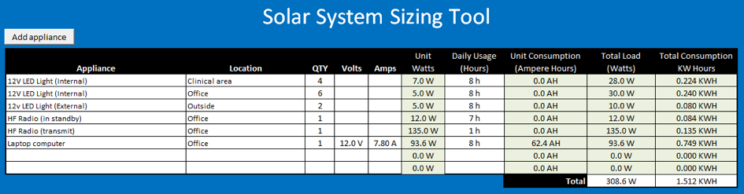
The first two columns are used to describe each electrical appliance and its location. Where there are duplicate items such as lights, one line can be used and the number of identical items specified in the third column. The volts and amps columns are filled and the power consumption will be calculated in the watts column. If power consumption is known, the volts and amps columns can be left blank and the watts value entered directly. 

The daily usage column must be filled in for each line as it is an essential value to calculating the overall size of the solar system. 

The ampere hours column will display information if the volts and amps columns are filled in. This column is for information only and data displayed is not used in any further design calculations. 

The final two columns display total load and consumption per line. The total consumption values at the foot of the table are linked to calculations which are made on the next page. 

##### Page 2: Additional information and results
The analysis page is divided up into four sections.
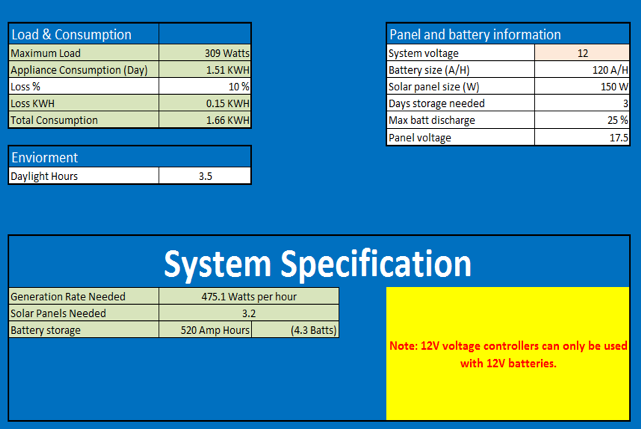

**Load and consumption**: The first two lines contain the total values from the first page. An energy loss value should be entered into the middle box in this section. 10% is a reliable average to use. The percentage value is converted to actual power loss which is displayed in the next line. This value is added to the overall total to provide the amount of energy required over a 24 hour period.

**Daylight**: The calculations in the tool assume a maximum power output from the solar panels throughout that day. In reality, maximum output will be around midday when the sun is at its maximum strength. As the panels do not move with the sun, energy reduction will be less during the period before 1100 and after 1300. The suggested value to use is 3.5 hours. This value is conservative but should provision some excess capacity for the reserve power. The figure may be revised downwards if the panels are covered by shadows for any part of the day.  

**Panel and battery information**: The red box should be used to select the correct system voltage i.e. the voltage used by the appliances. There are only two choices, 12v and 24v. 
* Battery size should be filled in – the standard term is Ampere Hours (A/H)
* Enter the solar panel maximum output in Watts
* Specify how many days autonomy is required without solar energy generation. 
* Specify how low the battery will be permitted to discharged (a value below 25% is not recommended)
* Enter the operating voltage for the solar panel (It may not be the same as the supply voltage)

**System Specification**: This box contains the results of the calculations. The tool takes the amount of energy needed and the hours of sunlight available to calculate the generation rate. The generation rate is then used to calculate the number of solar panels required.

Total battery storage is calculated in Ampere Hours and then compared to battery size to give the number of batteries needed. The battery specification will be altered depending upon the

#### Multiple Sites
For larger scale projects involving multiple sites, the best approach is to define a standard design for all sites, or series of standard of designs if sites vary in size. For example, a project to install solar energy into 100 sites could utilise a few as 4 or 5 designs ranging from a few lights for a health post to lighting, radio and a computer in a large clinic. 

Standardisation will ensure that the same components will be used across sites. Standardisation simplifies the overall rollout of a project which means that deployment can be speeded up by pre-manufacture of some modules (e.g. Controller, circuit breakers can be pre-wired and mounted on a board to be attached to a wall).

### Typical system design
The following diagram shows the layout of a typical solar system. The green lines represent earthing circuits, red lines for the high power from the solar array to the regulator and the blue line for the 12V DC supply circuit.

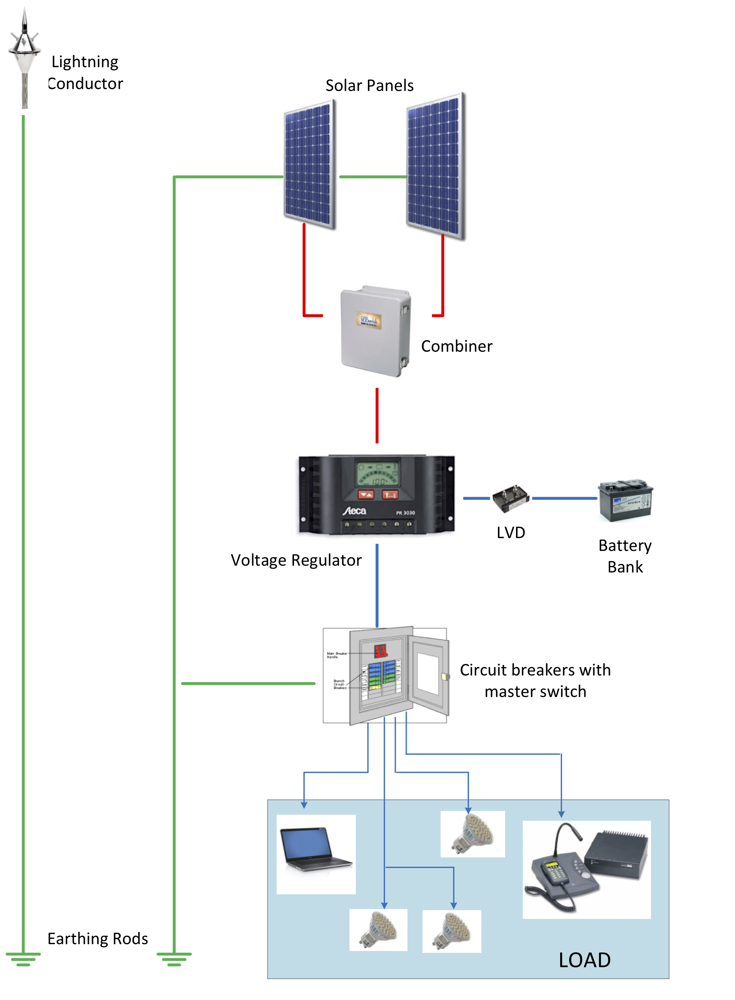

**Solar Panels**: Panels are available in most countries and there is a wide choice of qualities and capacities. A typical panel with a size of 1.5m x 0.6m will have an approximate power output of 150W. Larger panels with greater outputs are available. In designing a solar system, the physical size of panels should be taken into consideration as a greater number of smaller panels may be easier to transport and install than the larger panels.  

Panels will need to be secured firmly so that they will withstand high winds. Orientation is important as the aim is to position the panels in a way that they capture the most amount of light as possible. Depending on the latitude of the site, panels will either face either North or South and tilted to a specific angle. There are plenty of calculation tools online which will accurately define the orientation for you.

Panels should never be mounted in a horizontal position. Some tilt will always be needed to allow water to run off. 

**Combiner**: A combiner will usually be required where two or more panels are used. A group of solar panels is known as an “Array”. The purpose of the combiner is to take the outputs from each panel in the array and feed the power down to the controller. The combiner circuit can be set to ling panels in a parallel or series electrical circuit. The choice of circuit has an impact on the voltage and current being sent to the controller.  The following table illustrates the voltage and current output for an array for both circuit options. This example is for an array consisting of three panels which each have an output of 150W at 17.5 V.

 | | Parallel Circuit | Series Circuit |
 | --- | --- | --- |
 | **Total Power** | 3 x 150W = **450W** | 3 x 150W = **450W** |
 | **Volts** | **17.5V DC** | 3 x 17.5V = **52.5V** |
 | **Current** | 450W ÷ 17.5v = **25.7A** | 450W ÷ 52.5 = **8.6A** |

There are some distinct advantages in using a series circuit arrangement for the array. Higher voltages lose less power over a long cable run. Whilst power output (in this case 450W) is constant, the power equation of **I x V=W** shows that an increase in voltage results in reduced current. Lower current means that thinner cables may be used, thus reduced costs. 

**Voltage Regulator**: This device is a key part of the circuit and has three functions; 
* Accept voltage from the solar array and supply charging voltage to batteries. Charging is stopped when batteries reach full capacity. 
* Route energy from the solar panels to the load (converting to 12V) when energy is being generated. 
* Route energy from the batteries to the load when energy is not being created e.g. at night. 

During the day when energy is be produced by the panels, the controller will divide the output so that some energy will go direct to the load as well as the batteries. 

Voltage regulators will supply the same stable voltage to the battery and load (12V or 24V depending on which system is specified). The controller may be able to accept a wide range of voltages from the panels. This range should be checked carefully as the input from the panels should not exceed the maximum allowed (over voltages is more of a risk for series circuits). 

A regulator will also have a maximum current capacity which is measured in Amps. Careful design is needed so that the correct size regulator is selected for the system. 

**Low Voltage Disconnect (LVD)**: If a battery bank’s capacity is drained to less than 25% of its full capacity, permanent damage will be done to the battery cells. The LVD is designed to cut the power supply from the battery to prevent capacity dropping below the 25% level. 

**Circuit Breakers**: There are plenty of ways to set up circuit breakers, but as a minimum, there should be at least one master breaker to protect the voltage regulator from overloading. Additional breakers further down line can be used to isolate individual circuits. A breaker to isolate the panels from the rest of the circuit should also be considered. 

### Lightning Protection
Lightning is a very common cause of failures in solar energy systems. Damage to panels can occur due to the energy surges produced by lightning strikes many miles away or between clouds. This damage is easily preventable by ensuring panels are grounded. Further protection can be provided by installing one or more lightning conductors. 

The overall system diagram shows two separate measures which can be used to protect a system. The grounding is essential and should be present in all solar installations. The Lightning conductor system will provide additional protection and is normally used in places which are at extreme risk from lightning strikes. 

**Grounding**: All solar panels and their frames should be joined by heavy duty earthing cable. This process is often known as bonding. Bonding cables connect to all panels and run to a grounding rod. As cables are often made of copper and solar arrays are made of aluminium, there is a risk of corrosion where the two metals meet. Special connectors can be used to link the bonding cables to the panels thus reducing corrosion. 

Avoid making sharp corners in the earthing cables as high energy surges do not like to follow sharp corners and may jump to other cables nearby this causing damage.

At least one grounding rod should be installed where possible in a place where the ground is moist. Conductivity can be further improved by surrounding the rod with a mix of salt and charcoal (see picture below). In places where the ground is dry, a single rod is unlikely to be sufficient.

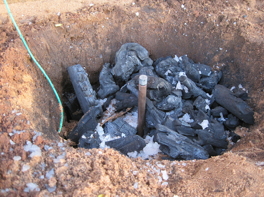

Rods should be around 2m long and if more than one is to be used, a separation of around 6m is desirable. Both rods should be joined by bare copper wire which is run underground.

In addition to the panels, the circuit should also be grounded. It is normal practice for electricians to ground the negative side of the circuit in a DC system and the neutral part of the circuit for AC systems. 

HF radio systems also require to be grounded as a grounding rod forms part of the aerial system. The ground used for a radio system must be independent and not connected in any way to the solar grounding system. 

**Lightning Conductor**:  The lightning conductor system is independent of the solar circuit and is designed to prevent a build-up of static charge and eventual ionisation of the surrounding atmosphere. This can prevent a strike from occurring, and provide a direct path to the ground should a lighting strike occur. 

The conductor will consist of a multi-pointed conductor which should be placed well above the area to be protected. As can be seen the diagram below, the area of protection extends downwards in a cone covering a 45˚ angle.

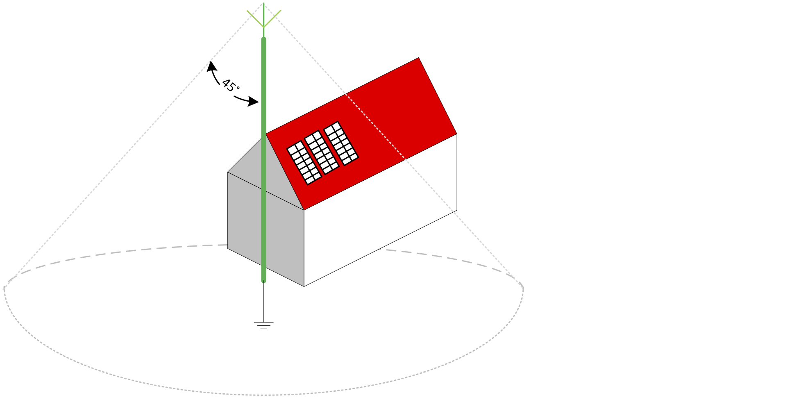

The conductor is mounted on a pole and the multi-spike conductor unit is linked to its own grounding rod by a thick copper cable. 

For larger solar arrays more than one lightning conductor may be needed to provide adequate protection. 

### The Load
The electric load consists of all items which will be powered at the site. Careful thought is needed when selecting appliances which will be powered by the system. The overall aim of any design is to get the maximum efficiency from the design. Large loads such as kettles should not form part of any load which is powered by a solar energy system.

If refrigeration is needed, the best approach is to use a separate stand-alone solar refrigeration system which is not connected to the main solar supply. There are plenty of WHO approved systems. 

The following example illustrates the impact of adding a large load to a modest circuit. 
 > A site equipped with 12 x 7W LED lights will require 2 solar panels. If we were to add a 1.5 KW kettle, three additional solar panels, a 2KW inverter and 7 batteries would be required. This additional kit is based upon the kettle being used for only 1 hour a day. 

**Cables**: When selecting cables for a system, size matters! If cables are too thin, there will be energy losses and in extreme cases, a risk of fire if cables are overloaded. In low voltage DC circuits, current will be higher than in a 220V AC circuit thus thicker cables are normally required. When designing a solar system, it’s important to calculate the load in various parts of the circuit and specify the correct cable size. The table below shows what sizes are recommended for different loads. AWG is the standard used in the USA and Caribbean, mm2 is the standard used by Europe, Africa and Asia. 

#### Cable Sizing Table
 | mm2 | AWG | Maximum current loading |
 | --- | --- | --- | --- |
 | 1 | 20 | 7A |
 | 1 | 18 | 10 A |
 | 1.5 | 16 | 15 A |
 | 2.5 | 14 | 20 A |
 | 4 | 12 | 25 A |
 | 6 | - | 36 A |
 | 10 | 10 | 40 A |
 | 16 | 8 | 65 A |

**Inverters**: If an inverter is absolutely necessary, make sure that it is specified to match the load it will supply as closely as possible. There will be an energy loss during conversion from DC to AC. The larger the inverter, the greater the power loss will be. 

### Rugged design
If a solar system is not built ruggedly, it will not last. When designing a system, the following design aspects must be considered; 
* Panels must be mounted on sturdy frames and the frames secured to the building. The installation must be able to withstand high winds.

* All fixtures and fittings must me secured to ceilings using wood screws, and for solid walls, raw plugs to give the screws a secure foundation. Nails should never be used. 

* Where possible, switchgear, batteries, controllers should be set up in a secure room and where needed, within secured enclosures. 

* External cables to be run through pipes to prevent damage from UV. 

* Circuit cables to be enclosed within conduit. 

* Any cables which pass through roof spaces should be protected by steel pipes to prevent rodents from eating the cable insulation. 

### Change Management
A strict change management regime must be put in place to prevent unauthorised and unqualified people from modifying the solar system. Some of the measures taken to develop a rugged design will go some way to prevent unauthorised modifications at the site were the system is in use. 

If there is a requirement to add more electrical loads to the system, it should be done in a controlled way as any increase will probably require the addition of new batteries and panels. Controllers and cables may also need upgrading. 

If controls are not put in place, it is likely that the existing system will not have the capacity to service the increase load and power will go offline as batteries will run out of energy. 

A change management policy needs to define who is authorised to approve changes, the people who will carry out the electrical work to a high standard and how the change will be financed. The policy needs to be communicated to all staff at the site where the system is installed and rigorously enforced. 

### Maintenance and sustainability
Any solar project must be set up in such a way that it is sustainable. It’s important to avoid activities where a solar system is installed and the recipients left to manage the system. 

A successful and sustainable project will consist of the following aspects:
* Viable local supply chain of replacement parts and consumables.
* Local capacity built so that maintenance and repairs will be conducted on an on-going basis.
* Clear operational guides backed up with onsite training. This should take place as part of the process to hand the system over to the recipients. 

People based at the site will be able to carry out basic maintenance such as changing light bulbs and monitoring battery status. They should also be asked to keep an eye on any vegetation and to cut back any growth which may begin to cast shadows on the panels.

More complex engineering tasks should be left to qualified and experienced technicians. There are a number of ways to facilitate on-going skilled systems support. Here are some examples;
1. The installation can be outsourced to a local solar energy provider. When all installation is complete, an on-going support contract can be agreed between the supplier and the recipient.
2. For large scale projects, a dedicated project manager will be needed. The PM will be able to build up a skilled team of installers who will set up all sites. At the end of the project, the team can be transferred into the direct employment of the recipient organisation. An example of this can be found in Liberia where a project to install systems into over 200 clinics will result in a new renewable energy department in the Ministry of Health consisting of former NGO project installation engineers. 

