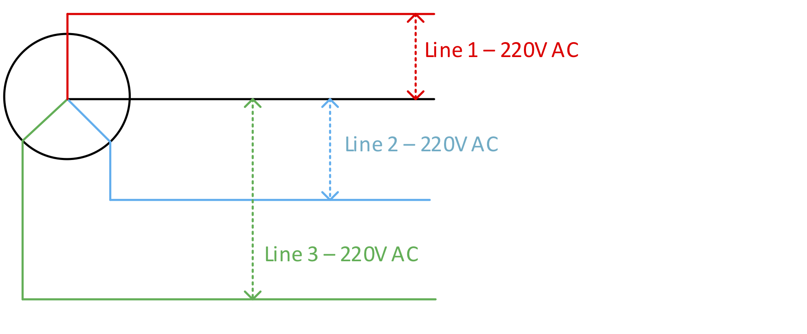

# Electricity Distribution, Generation and Renewable Energy Guide
## v 1.02

## Introduction

Whether it’s an office, clinic, school or the residence, electricity is an essential utility. Unlike developed countries, access to clean, reliable and safe power in the global south can be difficult and in many cases expensive. 

Access to a reliable power supplies is essential to humanitarian programming. Power is needed for lighting, cold chain, heating, communications and to run IT systems. The provisioning of safe power is also very challenging as materials in some places will be of poor quality. Lack of skills can lead to poorly installed systems which pose a serious risk to equipment and people. 

This guide has been written to improve the knowledge people managing humanitarian programmes about electricity supplies. Whilst it contains a lot of best practice advice and tips, this guide is not intended to be a detailed electrical installation guide. Electrical installations should always be carried out by qualified electricians who have demonstrable skills. 

Whilst it’s very unlikely that the high standards required under law (IEE for the UK) will be reached, aid organisations have a responsibility to all of its team to provide a safe working environment. This guide illustrates electrical best practices.

This guide also includes some planning tools to help you estimate energy needs for any site. Good planning will enable you to select the correct size generator or solar system for the site. 

The first edition of this guide was created by Mark Hawkins for Merlin in 2012. It has now been shared freely with the Nethope community to help all members to create a safe working environment for Aid Workers and beneficiaries. I hope that in the near version, that this guide will be replaced with a more up to date version incorporating more information about renewable energy. 

Mark Hawkins 
Global Humanitarian Technology Manager 
Save the Children International 
December 2018

## Contents
1. [Introduction](#Introduction)
2. [Safety](Safety)
    - [Electricity Kills!](#electricity-kills)
    - [Fire Risk!](#fire-risk)
    - [Working practices](#working-practices)
3. [Power Supplies](#power-supplies)
    - [Sources](#sources)
    - [Single Phase](#single-phase)
    - [Three Phase](#three-phase)
    - [American Standards](#american-standards)
4. Power Distribution
    - Circuit Design
    - Grounding
    - Quality of parts
5. Site Planning
    - Utility Power
    - Stored Energy
    - Selecting the correct generator
    - The energy planning toolkit
        - Generator Sizing Tool
    - Cable sizing tool
6. Generator Management
    - Daily routines
    - Weekly Routines
    - Monitoring
    - Servicing
    - Spares & Consumables
    - Change Management
7. Solar Energy
    - Planning
    - Typical system design
    - Lightning Protection
    - The Load
    - Rugged design
    - Change Management
    - Maintenance and sustainability

## Safety
This chapter highlights some of the risk experienced in NGO sites every day. Whilst there are a few extreme examples of bad practice or poor design mentioned, the majority of the problems illustrated have been collected from a wide range of sites over the past fifteen years.
### Electricity Kills!
In the aid sector, the provision of a safe and efficient electrical system is not treated as a priority. As a result, severe risk of electrocution will exist in the office, the bathroom and the bedroom. There have been reports from the field where team members have received electric shocks whilst operating equipment. In one severe case, an aid work was killed in one agency when a team member was electrocuted in a bathroom

Here are some examples of defects which are presenting danger to people;

 | Example | Description |
 | --- | --- | 
 |  | A wall socket was missing in a bedroom leaving two bare wires exposed. A visitor to the room not aware of this cable could have easily touched it and may have received an electric shock. |
 |  | 
A power line from the national grid comes over the wall. The power cables are not insulated. Under normal circumstances this would not be an issue as grid cables arrive at roof level well out of the reach of people.

In this example, the cables pass within centimetres of a roof ladder. There are two significant risks here
<ul><li>People ascending the wall ladder to deal with communications equipment is very likely to come into contact with the live cable.</li><li>If the ladder comes into contact with the cable, it becomes electrified. The bottom of this fixed ladder is close to a busy passageway.</li></ul> |

### Fire Risk!
Poor quality electrical installations can cause fires through short circuits. There is one extreme example where an electrical fault in an ammunition store resulted in major explosions in Brazzaville (Republic of Congo) in March 2012. More recently in 2017, an NGO suffered a series fires it its country head office (south Sudan) because the cabling used was too thin.

Fires can happen as a result of overloading of circuits, poor storage of flammable liquids, paints, gases as solids adjacent to switches and generators. The breakdown of cable insulation can lead to fire. Rodents in roof spaces are well-known for eating insulation. Once the plastic insulation has gone, roof fires can easily occur.

### Working Practices
Unskilled staff working with poor quality tools will also be at risk. In developing countries, electrician’s tools are normally of a poor quality and poorly insulated. 

### Conclusion
Now that you have read all the horror stories about what could happen if we neglect the concept of safe electrical practice, please read on!  The rest of this guide explains how safe and reliable electricity can be achieved. 

## Power Supplies
A stable power supply is essential for the smooth running of appliances in offices and residences. Where supplies are unstable, measures will be needed to protect equipment and in some cases to ensure continuity of supply during power cuts.

Supply voltages will be different depending upon the country and circuit type used. In most places, voltages will be 220V, but in the USA, South America and the Caribbean, it will be 110V. Some circuits will contain a mixture of voltages, which means a lot of care needs to be taken by electricians when setting up power systems.

### Sources
In general, power will come from one of three sources, the local grid, and a generator or from battery (charged via a battery charger or a solar system). For smaller sites which rely on battery storage, it’s often better to set up as many systems as possible to run on 12v. Where needed, inverters can be used to convert 12V DC to either 220V or 110V AC.

Quite often, a combination of sources will be required for example a backup generator may be needed for places where grid power is unreliable. Where there is no grid supply at all, two generators will probably be needed.

### Single Phase
Most people direct experience of electricity will be in either the home or office where single phase power is normally used. In Europe, Africa Asia and the Middle East, the voltages will be 220V AC, but in the USA, South America and the Caribbean, its 110V AC.

Single phase supplies are simple and consist of two lines to supply power (Neutral and Live). A third Earth cable is also included for safety.

Smaller generators (typically less than 9 KVA) will produce single phase power.

### Three Phase
Almost all utility companies will generate electricity using three phase power. Whilst single phase is normally supplied to smaller domestic buildings, larger buildings may be supplied by three phase power.  The output from larger generators will also be three phase.

Three phase power consists of three lines each providing 220V AC. A clear understanding of how these lines relate to each other is essential as if mistakes are made in setting up circuits, it’s possible to supply 380V AC to a circuit and cause a lot of damage. 

If three phase power is supplied from a generator, the site circuit must be designed in such a way so that the total load from all electrical items on the site is equally distributed across all three phases. 

Over the years, there have been plenty of examples where a single output on a three phase generator has been used. This will significantly shorten the life of the generator as the wear on the internal parts will not be even. The alternator is the part of the generator which creates the electricity. As internal parts rotate, if only one phase is used, resistance will only be encountered for just 1/3rd of each rotation. This is uneven resistance is what causes the excessive wear on bearings and windings. 

The following diagram shows a typical output from a three phase supply which consists of four cables. A neutral line is common to the other three lines. So a link between neutral and any of the three “Live” lines will deliver a 220V AC Supply. 

**BEWARE!!!**
**Never connect equipment between the “Live” lines (1+2, 1+3, or 2+3) as the respective voltage will be 380V AC. The correct way to provide supplies will always be a combination of one “Live” line and “Neutral”**

Alternating Current (AC) from either a generator or a utility supply will alternate between +220V and -220C up to 60 times per second. The transition from positive to negative follows a “Sine Wave” pattern.

In a three phase circuit, the outputs from the three lines are not synchronised. They are in fact separated by about 1 third of a cycle (which is the same as one third of a rotation on the generator).

The diagram below demonstrates clearly the relationship between the lines. 

If measurements are taken between any of the lines and neutral, the maximum voltage reached is 220V AC. This is shown by the red dotted line. 

The blue dotted line shows a measurement between the red line and the blue line where the blue voltage is at +220V and the red voltage is at -160V. This means that the total difference in voltage between the two lines is 380V AC.

### American Standards
Power generation in the USA starts out in the same way as it does for the rest of the world as three phase power. In a typical domestic residence, two lines of 110V AC is supplied. The twin outputs is derived from a 220V AC single phase line via a centre tapped transformer which would be located in a neighbourhood substation. The diagram below shows how a centre tapped transformer modifies the output. 

The single phase input of 220V AC is feed to the primary coil in the transformer. The secondary coil has an identical number of winnings but a third cable is joined to the central winding. This results in twin outputs of AC which are exactly in opposite phases. So any device connected between the neutral and   either line will be supplied with 110V AC. By connecting directly between Lines 1 & 2, 220V AC is available. 

The following graph shows the relationship between both lines and how two lines of 110V can be used to provide 220V AC

It is common practice to supply both lines to domestic sites in the USA. In general, lines will be split up between floors where 110V is supplied to sockets and lights. Heavy duty appliances such as water heaters and air conditioning are normally hard wired into the circuit and supplied 220V AC by using both lines. 

For emergency teams deploying to places where USA circuits is used, it is often believed that step up transformers are needed to convert 110v to 220V. This is clearly not the case. As long as both lines can be clearly identified, a separate circuit can be used to supply 220V. Be sure to use a different type of plug and socket so that 110V equipment cannot be accidentally connected to the 220V supply. 

